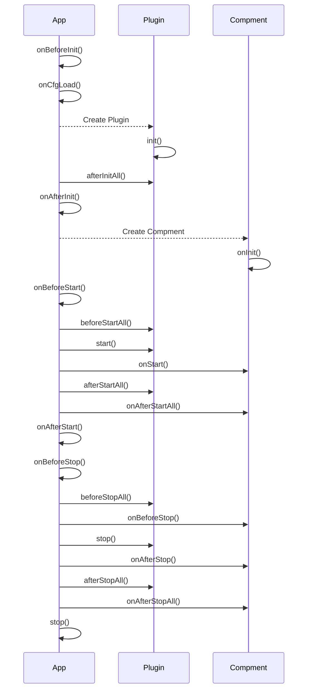

# Overview

Hw app framework.

## 结构
 - App, App 主程序
 - Plugin， 插件，某类功能，插件是有依赖顺序的
 - Compment，组件，没有依赖顺序


## 生命周期



## 命令行参数
通过命令行参数，可以把 配置 与 实例进行解耦。 便于对app进行分布式部署。
命令行解析使用了 库 [commander] 

```
Usage: hw-base [options]

Hw library base

Options:
  -V, --version                        output the version number
  -e, --env <env>                      app node run env. "development" | "production" | [other custom name] (default: "development")
  --app_name <app Name>                The App Name
  -m --use_ms_parame                   Use micro service parame, ignore config.json (default: false)
  --ms_disable                         Enable micro service (default: false)
  --ms_ip <ip>                         The service use IP
  --ms_port <number>                   The service port number
  --ms_prefix <string>                 微服务路由前缀
  -h, --help                           display help for command
  --api_doc                            gen swagger api doc (default: false)
```

### 扩展命令行 参数
HwAppBase 提供 下列函数，用于扩展 命令行
 1. cmdlineParser, 属性 返回 Command 实例，通过在 onBeforeInit 生命周期函数里，设置新的命令行参数。具体参见【 [commander] 】
 1. cmdOpts，实行返回解析后的命令行参数

扩展命令行提示。可以借用 .d.ts 的扩展属性，扩展命令行的语法提示
``` ts
// 扩展 命令行选项定义
export module "../types" {
    export interface HwAppCmdOpt {
        path?: string;
    }
}
```


## **HwAppBase** class
Hw APP 基类。

提供 Hw app 相关基础功能
* 提供插件 根据依赖加载的功能；
 - 依赖的配置，会在启动时挂载到 < app >._cfg.deps 下；

例子：
``` javascript
class Main extends base.HwAppBase
{
    constructor(){
        super();

        this.timer = null;

        /** 监控配置文件变化 */
        this.on('cfg_change', (alias, content, dataId) => {
            console.log( `--- alias: ${alias} dataId: ${dataId}, cfgChange: `, content );
        })
    }

    async onBeforeInit() {
        this.env.PROJ_PATH = this.env.PROJ_PATH + '/example';
        this.env.CFG_PATH = this.env.PROJ_PATH + '/config';
        console.log( '--- onBeforeInit' );
    }

    async onAfterInit() {
        console.log( '--- onAfterInit' );
    }

    async onBeforeStart(){
        this.logger.info( this.env.PROJ_PATH);

        console.log( '-- onBeforeStart' );
    }

    async onAfterStart(){
        console.log( '-- onAfterStart' );
    }

    async onBeforeStop(){
        console.log( '--- onBeforeStop' );
    }

    async onAfterStop(){
        console.log( '--- onAfterStop' );
        process.exit(0)
    }
}

```

## 框架事件函数

框架为派生类，提供了 一系列生命周期事件函数。
 
* onBeforeInit, 框架及所有的插件初始化开始之前调用
* onCfgLoad, config.json 读取后,命令行参数解析后调用，提供动态修改配置的机会
* onAfterInit, 框架及所有的插件初始化完成后调用
* onBeforeStart, 框架及所有的插件启动开始之前调用
* onAfterStart, 框架及所有的插件启动完成后调用
* onBeforeStop, 框架及所有的插件停止之前调用
* onAfterStop, 框架及所有的插件完全停止后调用

### API

#### Property
 * _ms 微服务
 * env 环境变量
 * logger 日志

#### Function
 * ```getConfig(cfgName: string)```,  获取指定名称的配置
 * ```getPlugin(pluginName: string)```, 获取指定名称的插件

## 微服务
为APP提供微服务功能；
 * 采用 http 协议对外提供接口调用；

下面是配置例子
``` js
{
"mservice":{
    "enable": true,
    "ip": "127.0.0.1"
    "port": 80,
    "cors": ["regex:127.0.0.1:[0-9]{1,}"],
    "finder": {
        "enable": true,
        "base": {
            "serverAddr": "127.0.0.1:8848",
            "namespace": "public",
            "group": "DEFAULT_GROUP",
            "redis": {
                "host": "127.0.0.1",
                "port": 6379,
                "password": "111111",
                "db": 1
            }
        },
        "naming": {
            "enable": true,
            "serviceName": "hw.test",
            "weight": 1,
            "subscribe": [
                {
                    "serviceName": "hw.qt.marketDataReceive",
                    "group": "DEFAULT_GROUP"
                }
            ]
        },
        "config": {
            "enable": true,
            "dependencies": [ "redis"],
            "subscribe": [
                {
                    "dataId": "redis",
                    "group": "DEFAULT_GROUP",
                    "alias": "redis"
                }
            ]
        }
    }
},


"mcache":{
    // 把所有元素转换为字符串
    forceString: false,

    // 缺省超期时间. 0 = infinity;
    stdTTL: 0,

    // 检测超期时间间隔秒
    checkperiod: 300,

    // 是否开启 clone, true, get 将返回一份副本，false将返回引用    
    useClones: true,

    // 是否在超期时自动删除
    deleteOnExpire: true,
    // 最大键数量
    maxKeys: -1
},

/** 节点名字 */
nodeName: 'node1', // string
cfgRedis: {
    /** 是否从 redis 获取配置，缺省 false,不从 redis 获取 */
    enable: false,

    /** 触发cfg_change事件(配置文件更新事件时,传输的key), app的主配置文件名 */
    key: 'thirdProductMonitor',

    /** 使用的订阅插件的别名,接收配置改变 */
    mqAlias: "_mq",

    /** 使用的redis插件的别名 */
    rdAlias: "_rd"
}

}
```
* ip, 可选，不配置，自动获取 非 127.0.0.1的IP(在容器环境可能获取不到);
* cors，设置ms请求的跨域配置, 
 - 不设置，则不允许跨域
 - true 允许所有源
 - string[], 允许指定源（可以是正则表达式，正则表达式以 ```regex```: 开始）
* serverList, string | string[]
* namespace, 没指定，使用缺省
* group, 没指定，使用 'DEFAULT_GROUP'
* config.subscribe.group 可选，没有指定，则使用 config.group 指定的
* nodeName, 节点名字,如果没配置,则默认为 `${this._cfg.mservice.ip}_${this._cfg.mservice.port}`, 例如`127.0.0.1_80`
* cfgRedis, 表示app主配置从redis获取
  * 配置的redis键值为 `cfg:<serverId>:<nodeName>`
  * redis 里 的配置发生改变后，可以通过redis发送通知
    * channel： cfg:appnode
    * msg: `cfg:<serverId>:<nodeName>`

**注意**
> - <font color="red">serverId 会被 命令行参数 --app_name 更改</font>


### api 文档

框架提供 --api_doc 命令行参数，用于生成 api文档，可以通过 /api_docs 访问.

**配置**

直接在 `package.json`的`apiGen.apis`制定.

```json 
{
   "apiGen": {
    "apis": [
      "mservices/services/*.js"
    ],
    "allowedTags": [""]

  }
}
```

* apis, 制定要生成api文档的文件
* allowedTags, 制定要生成api文档的标签，不配置，则生成所有标签的api文档


## 插件
插件基类 ``` HwPluginBase ```，为插件提供基本属性 派生自 EventEmitter

### 属性
 * app， 插件所属APP实例
 * name, 插件名字
 * alias 插件昵称
 * info 插件信息

### 方法
 * getConfig() 获取配置，如果配置设置了昵称，则已昵称为名称，否则已插件名称，从app获取插件配置


 [commander]: https://www.npmjs.com/package/commander
