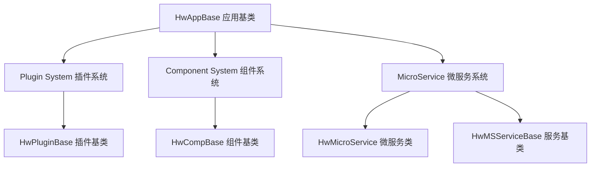
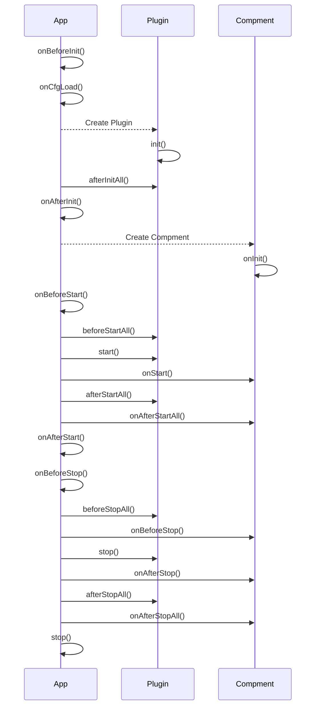

# HW Framework 项目文档

## 项目概述

HW Framework 是一个基于 Node.js 的应用框架，提供了微服务、插件化架构、组件系统等核心功能。该框架设计用于构建分布式、可扩展的企业应用。

## 项目信息

- **名称**: @heywoogames/hw-base
- **版本**: 2.1.0
- **描述**: HW library base
- **主入口**: main.js
- **类型定义**: types/index.d.ts

## 项目结构

```
base/
├── lib/                          # 核心库文件
│   ├── mservices/               # 微服务相关
│   │   ├── index.js            # 微服务主类 HwMicroService
│   │   └── finder.js           # 发现服务 集成
│   ├── msServiceBase.js        # 微服务基类
│   ├── hwbase.js             # 框架核心基类 HwAppBase
│   ├── hwCompBase.js         # 组件基类
│   └── pluginBase.js          # 插件基类
├── types/                       # TypeScript 类型定义
│   ├── index.d.ts             # 主类型导出
│   ├── HwAppBase.d.ts        # 应用基类类型  
│   └── HwBase.d.ts           # 基础类型定义
├── example/                     # 示例代码
│   ├── config/                # 示例配置文件
│   ├── comps/                 # 示例组件
│   ├── mservices/             # 示例微服务
│   ├── plugins/               # 示例插件
│   ├── package.json          # 示例项目配置
│   └── test.js               # 示例应用入口
├── doc/                     # 文档目录
├── main.js                     # 框架入口文件
├── package.json               # 项目配置
├── README.md                  # 项目说明
├── eslint.config.js          # ESLint 配置
└── jsconfig.json             # JavaScript 项目配置
```

## 核心架构

### 1. 术语

* 框架，应用框架，应用基类，从 `HwAppBase` 派生
* 插件，插件系统，可复用功能的抽象，可以作为独立包发布，方便在各个项目之间复用,从`HwPluginBase`派生;
* 组件，组件系统，在应用内使用，从类 `HwCompBase` 派生
* 微服务，微服务系统，微服务基类，从 `HwMSServiceBase` 派生


### 1. 三层架构模式



### 2. 生命周期管理



## 核心类详解

### 1. HwAppBase - 应用基类

**位置**: `lib/hwbase.js` 

**描述**: 框架的核心基类，提供应用的基础功能和生命周期管理。

#### 主要特性

- **事件驱动**: 继承自 EventEmitter，支持事件监听
- **命令行解析**: 集成 commander.js，支持丰富的命令行参数
- **插件系统**: 支持依赖排序的插件加载
- **组件系统**: 支持无依赖组件管理
- **微服务集成**: 集成 Express.js

#### 生命周期方法

```javascript
class YourApp extends HwAppBase {
    async onBeforeInit() { /* 初始化前 */ }
    async onCfgLoad() { /* 配置加载后 */ }
    async onAfterInit() { /* 初始化后 */ }
    async onBeforeStart() { /* 启动前 */ }
    async onAfterStart() { /* 启动后 */ }
    async onBeforeStop() { /* 停止前 */ }
    async onAfterStop() { /* 停止后 */ }
}
```

#### 核心 API

```javascript
// 配置管理
await app.getConfig('config.json')         // 获取配置
await app.getLocalConfig('local.json')     // 获取本地配置

// 插件管理
app.getPlugin('pluginName')                // 获取插件实例

// 组件管理  
app.getComp('componentName')               // 获取组件实例

// 微服务响应
app.makeMSResp(0, data, 'success')         // 创建响应
app.makeMSRespSucc(data)                   // 创建成功响应
app.makeMSRespFail(500, 'error')           // 创建失败响应

// 环境变量
app.env.PROJ_PATH                          // 项目路径
app.env.serverId                           // 服务ID
app.logger                                 // 日志实例
```

### 2. HwPluginBase - 插件基类

**位置**: `lib/pluginBase.js`

**描述**: 所有插件的基类，提供插件的标准接口和生命周期。

#### 特性

- **依赖管理**: 支持插件间的依赖关系
- **配置自动加载**: 自动加载对应的配置文件
- **完整生命周期**: 提供丰富的生命周期钩子

#### 生命周期方法

```javascript
class YourPlugin extends HwPluginBase {
    async init() { /* 插件初始化 */ }
    async start() { /* 插件启动 */ }
    async stop() { /* 插件停止 */ }
    
    async afterInitAll() { /* 所有插件初始化后 */ }
    async beforeStartAll() { /* 所有插件启动前 */ }
    async afterStartAll() { /* 所有插件启动后 */ }
    async beforeStopAll() { /* 所有插件停止前 */ }
    async afterStopAll() { /* 所有插件停止后 */ }
}
```

### 3. HwCompBase - 组件基类

**位置**: `lib/hwCompBase.js`

**描述**: 组件系统的基类，组件没有依赖关系，按加载顺序执行。

#### 生命周期方法

```javascript
class YourComponent extends HwCompBase {
    constructor(app) {
        super(app);
        this.name = 'yourComponentName';
    }
    
    async onInit() { /* 组件初始化 */ }
    async onStart() { /* 组件启动 */ }
    async onAfterStartAll() { /* 所有组件启动后 */ }
    async onBeforeStop() { /* 组件停止前 */ }
    async onAfterStop() { /* 组件停止后 */ }
    async onAfterStopAll() { /* 所有组件停止后 */ }
}
```

### 4. HwMicroService - 微服务类

**位置**: `lib/mservices/index.js`

**描述**: 提供 HTTP 微服务功能，集成 Express.js

#### 主要功能

- **HTTP 服务**: 基于 Express.js
- **跨域支持**: 可配置的 CORS 支持
- **动态路由**: 支持动态注册路由
- **响应扩展**: 扩展 Express Response 对象

#### API 示例

```javascript
// 注册路由
ms.registerMethod('get', '/api/test', (req, res) => {
    res.sendSucc({ message: 'Hello' });
});

// 设置静态文件
ms.setStaticPath('/public');

// 获取服务
const service = await ms.getService('serviceName');
```

### 5. HwMSServiceBase - 微服务基类

**位置**: `lib/msServiceBase.js`

**描述**: 微服务具体服务的基类，提供对 Express 和应用实例的访问。

```javascript
class YourService extends HwMSServiceBase {
    constructor(ms) {
        super(ms);
        
        // 注册路由
        this.eapp.get('/api/yourservice', (req, res) => {
            res.sendSucc('Service response');
        });
    }
}
```

## 配置系统

### 1. 主配置文件 (config.json)

```json
{
    "mservice": {
        "enable": true,
        "ip": "127.0.0.1",
        "port": 8080,
        "cors": true
    },
    "plugins": {
        "redis": {
            "enable": true,
            "path": "./plugins/redis.js",
            "dependencies": []
        }
    },
    "cfgRedis": {
        "enable": false,
        "key": "app:config",
        "mqAlias": "mq",
        "rdAlias": "redis"
    }
}
```

### 2. 环境变量配置

```javascript
// 环境变量对象
const env = {
    PROJ_PATH: '/project/path',      // 项目根路径
    CFG_PATH: '/project/path/config', // 配置文件路径
    env: 'development',              // 运行环境
    serverId: 'your-service',        // 服务ID
    version: '1.0.0',               // 版本号
    description: 'Service description' // 描述
};
```

## 命令行参数

框架提供丰富的命令行参数支持：

```bash
# 基础参数
node app.js --env production --app_name myservice

# 微服务参数
node app.js -m --ms_ip 192.168.1.100 --ms_port 8080

# 日志参数
node app.js --log_enable --log_ip 10.0.0.1 --log_port 5045
```

### 扩展命令行参数

```javascript
class YourApp extends HwAppBase {
    async onBeforeInit() {
        // 添加自定义命令行参数
        this.cmdlineParser.option('-p, --path <path>', 'custom path');
    }
    
    async onAfterInit() {
        // 获取命令行参数
        console.log(this.cmdOpts.path);
    }
}
```

## 使用示例

### 1. 基础应用

```javascript
const { HwAppBase } = require('@heywoogames/hw-base');

class MyApp extends HwAppBase {
    constructor() {
        super();
        
        // 监听配置变化
        this.on('cfg_change', (alias, content, dataId) => {
            console.log(`Config changed: ${alias}`);
        });
    }
    
    async onBeforeInit() {
        // 设置项目路径
        this.env.PROJ_PATH = __dirname;
        this.env.CFG_PATH = __dirname + '/config';
    }
    
    async onAfterStart() {
        this.logger.info('Application started successfully');
    }
}

// 启动应用
(async () => {
    const app = new MyApp();
    await app.init();
    await app.start();
})();
```

### 2. 创建插件

```javascript
const { HwPluginBase } = require('@heywoogames/hw-base');

class RedisPlugin extends HwPluginBase {
    constructor(app, plugInfo) {
        super(app, plugInfo);
        this.client = null;
    }
    
    async init() {
        const config = await this.getConfig();
        // 初始化 Redis 客户端
        this.client = createRedisClient(config);
    }
    
    async start() {
        await this.client.connect();
        this.app.logger.info('Redis plugin started');
    }
    
    async stop() {
        await this.client.disconnect();
        this.app.logger.info('Redis plugin stopped');
    }
}

module.exports = RedisPlugin;
```

### 3. 创建组件

```javascript
const { HwCompBase } = require('@heywoogames/hw-base');

class DataProcessor extends HwCompBase {
    constructor(app) {
        super(app);
        this.name = 'dataProcessor';
    }
    
    async onInit() {
        this.app.logger.info('Data processor initialized');
    }
    
    async onStart() {
        // 启动数据处理逻辑
        this.startProcessing();
    }
    
    startProcessing() {
        // 实现数据处理逻辑
    }
}

module.exports = DataProcessor;
```

### 4. 创建微服务

```javascript
const { HwMSServiceBase } = require('@heywoogames/hw-base');

class UserService extends HwMSServiceBase {
    constructor(ms) {
        super(ms);
        
        // 注册路由
        this.eapp.get('/api/users', this.getUsers.bind(this));
        this.eapp.post('/api/users', this.createUser.bind(this));
    }
    
    async getUsers(req, res) {
        try {
            const users = await this.fetchUsers();
            res.sendSucc(users);
        } catch (error) {
            res.sendFail(500, error.message);
        }
    }
    
    async createUser(req, res) {
        try {
            const user = await this.saveUser(req.body);
            res.sendSucc(user, 'User created successfully');
        } catch (error) {
            res.sendFail(400, error.message);
        }
    }
}

module.exports = UserService;
```

## 最佳实践

### 1. 项目结构建议

```
your-project/
├── config/
│   ├── config.json              # 主配置
│   ├── development/
│   │   └── config.json         # 开发环境配置
│   └── production/
│       └── config.json         # 生产环境配置
├── plugins/                     # 插件目录
├── comps/                      # 组件目录
├── mservices/
│   └── services/               # 微服务目录
├── app.js                      # 应用入口
└── package.json
```

### 2. 错误处理

```javascript
class YourApp extends HwAppBase {
    constructor() {
        super();
        
        // 全局错误处理
        process.on('uncaughtException', (err) => {
            this.logger.error('Uncaught Exception:', err);
        });
        
        process.on('unhandledRejection', (reason, promise) => {
            this.logger.error('Unhandled Rejection at:', promise, 'reason:', reason);
        });
    }
}
```

### 3. 配置管理

```javascript
// 优先级: 命令行参数 > 环境变量 > 配置文件
class YourApp extends HwAppBase {
    async onCfgLoad() {
        // 在这里可以修改配置
        if (process.env.NODE_ENV === 'production') {
            this._cfg.mservice.port = process.env.PORT || this._cfg.mservice.port;
        }
    }
}
```

## 依赖项

### 核心依赖
- **express**: Web 框架
- **commander**: 命令行解析
- **body-parser**: 请求体解析
- **cors**: 跨域支持

### 开发依赖

- **eslint**: 代码检查
- **eslint-plugin-jsdoc**: JSDoc 插件
- **eslint-plugin-node**: Node.js 插件

## 扩展点

### 1. 自定义插件

实现 `HwPluginBase` 接口，放置在 `plugins/` 目录下。

### 2. 自定义组件

实现 `HwCompBase` 接口，放置在 `comps/` 目录下。

### 3. 自定义微服务

实现 `HwMSServiceBase` 接口，放置在 `mservices/services/` 目录下。

### 4. 中间件扩展

```javascript
class YourApp extends HwAppBase {
    async onInitExpressMiddlewares(eapp) {
        // 添加自定义中间件
        eapp.use('/api', authMiddleware);
        eapp.use(loggerMiddleware);
    }
}
```

## 总结

HW Framework 是一个功能丰富、架构清晰的企业级 Node.js 框架。它提供了：

1. **模块化架构**: 通过插件和组件系统实现模块化
2. **微服务支持**: 内置 Express.js 集成
3. **配置管理**: 支持多环境、多来源的配置管理
4. **生命周期管理**: 完整的应用生命周期钩子
5. **扩展性**: 丰富的扩展点和自定义能力
